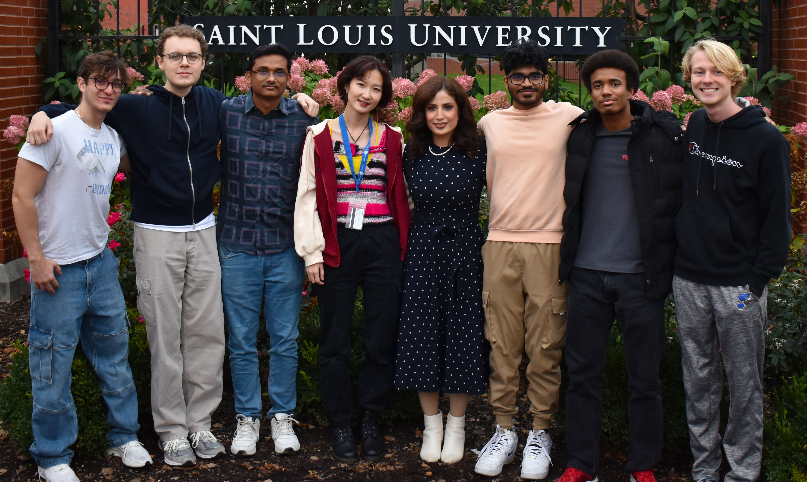

Hi there! I'm Guangping Liu. Welcome to my personal page!

# Biography
I am currently a PhD student at the [Mecharithm Lab](https://mecharithmlab.com/), supervised by Dr. Madi Babaiasl. I completed my master's degree from 2021 to 2023 and was a master's student at the [Neuromechanics of Movement Lab](https://neumove.org/) at Northeastern University from 2022 to 2023.

My Research Interests are: 
Assisted Robotics 
Robot Simulation 
Human Robot Interaction 

